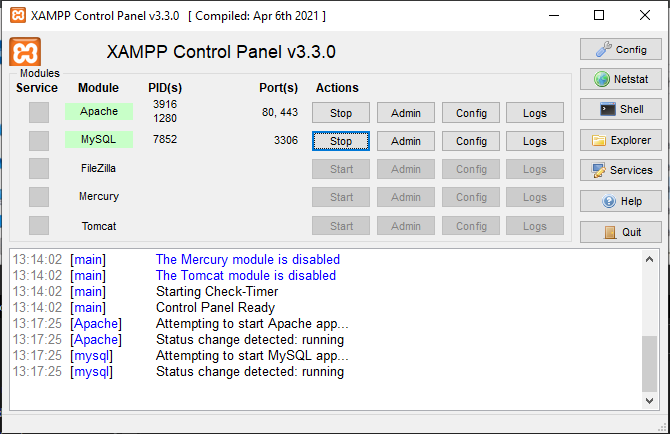

# Site IrrigAção

Este trabalho feio por mim que descreve o desenvolvimento de um site para controle e monitoramento da irrigação de uma plantação, com o objetivo de melhorar a eficiência do processo de irrigação e reduzir os custos de manutenção da plantação, para pequenos produtores rurais. O projeto foi desenvolvido no Instituto Federal de Educação, Ciência e Tecnologia de Rondônia (IFRO).

O site permite o acesso remoto aos dados de irrigação, como o estado das plantas e o histórico de irrigação. O sistema foi desenvolvido utilizando tecnologias web, como HTML, CSS e JavaScript, frameworks como Bootstrap e font-awesome oferecendo, oferecendo uma interface intuitiva para os usuários.

Embora a ideia inicial do projeto fosse a comunicação com placas embarcadas (arduinos) para o controle de humidade do solo e ativação da irrigação, essa parte ainda não foi implementada. Apenas a parte do site foi finalizada, e a programação das placas não foi realizada.

Em resumo, o projeto apresentado consiste em um site para controle e monitoramento de irrigação de plantações, que oferece uma solução eficiente e intuitiva para os usuários. No entanto, a comunicação com as placas embarcadas não foi implementada, sendo uma possibilidade de extensão para trabalhos futuros no Instituto.

Projeto de 2019 - IrrigAção.


## Stack utilizada

**Front-end:** HTML, CSS, Bootrap, Font-awesome, javascript.

**Back-end:** phpmyadmin, Apache, mysql.


## Instalação

Instale XAMPP -> https://www.apachefriends.org/pt_br/index.html

- Na instalação selecione apenas, Mysql e Apache na instalação.

- Apos a instalação agora você precisa inicializar os modulos de Apache e Mysql baixados assim como no exemplo:



- Agora você deve abrir o diretorio de instalação do xampp, diretorio padrão é o Disco local C, então acesse:

```bash
  cd C:\xampp\htdocs
```
- Dentro da pasta htdocs você vai colar sua pasta raiz do diretorio que deseja ser hospedado pelo xampp

- Agora no navegador web de sua preferencia digite na barra de pesquisa -> localhost

- Na area de dashboard acesse phpmyadmin e clique em novo, para criar um novo Schema de banco de dados, deixe  em utf8_general_ci e de o nome que achar melhor,

- Agora dentro desse novo schema criado na area Importar e escolha o arquivo dentro da pasta
```bash
  Irrigacao/banco e diversos/irrigacao.sql
```

- Finalize a importação e logo apos é só entrar no site exemplo:

Na barra de pesquisa digite:
localhost/Irrigacao/index.php 

- Com isso você ja podera navegar por todo o site e ter acesso a todas as funcionalidades.

## Screenshots


